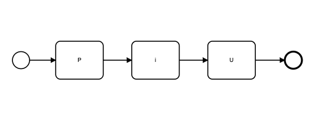
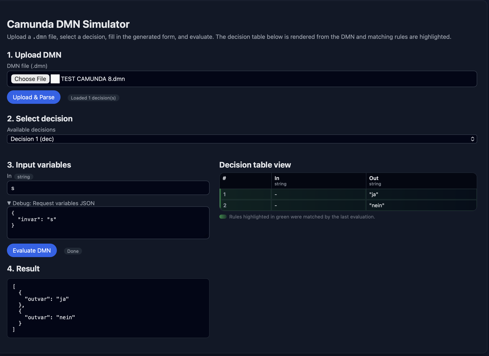

# Camunda DMN Simulator (Quarkus)



A small Quarkus application that lets you upload a Camunda 7 or 8 DMN (`.dmn`) file, choose a decision, enter input variables via a generated form and evaluate it. The matching decision table rules are highlighted visually in the browser.

## Tech stack

- Quarkus ${quarkus.platform.version}
- Java 25 (`maven.compiler.source/target = 25`)
- Camunda DMN engine `${camunda.dmn.version}`
- RESTEasy Reactive + Jackson

## Prerequisites

- Java 25 JDK on your PATH
- Maven 3.8+

## Build

```bash
mvn clean install
```

The Quarkus fast-jar is created under `target/quarkus-app`.

## Run in dev mode

```bash
mvn quarkus:dev
```

Then open:

- UI: http://localhost:8080/
- API base: http://localhost:8080/api/dmn

## Run the packaged app

```bash
mvn package
java -jar target/quarkus-app/quarkus-run.jar
```

## Using the simulator

1. Start the app (dev or packaged mode).
2. Open the UI at http://localhost:8080/.
3. Upload a Camunda 7 DMN XML file (`.dmn`).
4. Select a decision from the dropdown.
5. Fill in the generated input form.
6. Click **Evaluate DMN**.
7. Inspect the JSON result and highlighted decision table rows.

## REST API

Base path: `/api/dmn`

- `POST /api/dmn/parse` – parses DMN XML and returns available decisions and their inputs.
- `POST /api/dmn/evaluate` – evaluates a decision for a given variable map and returns
	the result and matched rule indexes.

See `DmnResource` and DTOs in `src/main/java/de/piu/camunda/dmn/simulator/dto` for exact payload structure.

Have fun your
G.O.D. of BPMN

www.piu.de